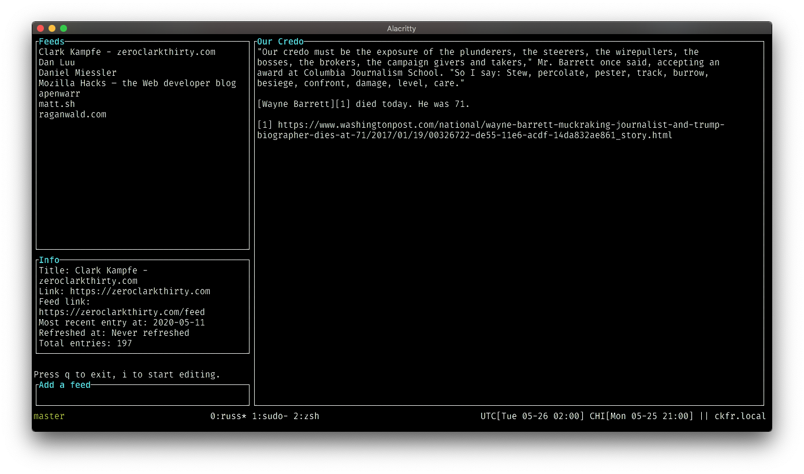

# russ

Russ is a really simple RSS reader built for my own use.
If you happen to like it, that's great!
At this time I cannot guarantee any kind of stability in either the software itself or the data format, or a timeframe for achieving stability. Caveat emptor.

</img>
</img>

## install/use

```
$ git clone
$ cargo install --path .
$ russ -d"your_db_name.db"
```

```
$ russ -h
russ 0.1.0
USAGE:
    russ [OPTIONS] --database-path <database-path>

FLAGS:
    -h, --help       Prints help information
    -V, --version    Prints version information

OPTIONS:
    -d, --database-path <database-path>            feed database path
    -e, --enhanced-graphics <enhanced-graphics>
            whether unicode symbols are used to improve the overall look of the app defaults to true

    -t, --tick-rate <tick-rate>                    time in ms between two ticks [default: 250]
```

## goals

1. A usable RSS client in the terminal, not in a webpage
1. Set up how I like it (vim-style navigation, columnar layout with higher-level info on the left, content on the right)
1. Fully offline operation
1. All application data in SQLite
1. Minimal configuration/options
1. As little resource usage as possible

## design

Russ is a [tui](https://crates.io/crates/tui) app that uses [crossterm](https://crates.io/crates/crossterm), so it should (???) work on Windows (I do not use Windows so I cannot verify this, but feel free to open an issue with an experience report)

It stores all application data in a SQLite database file at a location of your choosing. There is no default file. You need to specify this file when you start Russ (see above).

## todo

- [x] mark entries as read
- [x] atom support
- [ ] error handling/display
- [ ] debug view
- [ ] config (in db)
- [ ] deleting feeds
- [ ] better feed refreshing functionality
- [ ] some kind of search
- [x] configurable word wrapping line length
- [x] display info about an individual entry
- [x] rss support
- [x] adding feeds in-app
- [x] vim-style hjkl navigation
- [x] primitive feed refreshing functionality
- [x] html -> text conversion
- [x] entry reading/scrolling
- [x] display info about the feed