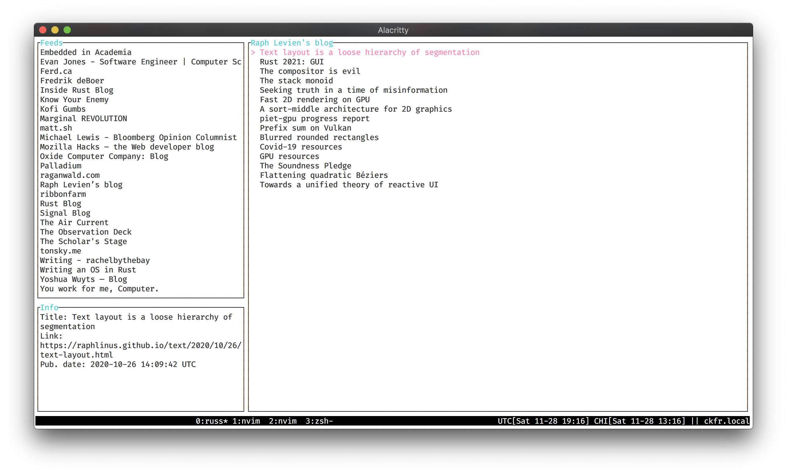

# russ

Russ is a TUI RSS/Atom reader with vim-like controls and an offline-first focus.

[](https://circleci.com/gh/ckampfe/russ)
[](https://github.com/ckampfe/russ/actions/workflows/rust.yml)

---

</img>
</img>

## install

```
$ cargo install russ --git https://github.com/ckampfe/russ
# note that on linux, you will need these system dependencies as well, for example:
$ sudo apt update && sudo apt install libxcb-shape0-dev libxcb-xfixes0-dev
$ russ -d"your_db_name.db"
```

I do not currently publish binary releases, but that may change if someone is interested in that.

## use

Russ is modal, like vim. If you are comfortable with vim, or know of vim, you are probably going to be immediately comfortable with Russ. If you don't know vim, don't be afraid! If you read the following controls section and tinker a bit, you'll have no trouble using Russ.

There are two modes: normal mode and insert mode.

In normal mode, you read your RSS entries, navigate between entries, navigate between feeds, refresh feeds, and a few other things. This is where you spend 99% of your time when using Russ.

When you want to start following a new feed, you enter insert mode.
In insert mode, you enter the URL of a feed you wish to begin following, and Russ will download that feed for you.

That's basically it!

### controls - normal mode

Some normal mode controls vary based on whether you are currently selecting a feed or an entry.

- `q`/`Esc` - quit Russ
- `hjkl`/arrows - move up/down/left/right between feeds and entries, scroll up/down on an entry
- `Enter` - read selected entry
- `r` - refresh the selected feed
- `r` - mark the selected entry as read
- `x` - refresh all feeds
- `i` - change to insert mode
- `a` - toggle between read/unread entries
- `c` - copy the selected link to the clipboard (feed or entry)
- `o` - open the selected link in your browser (feed or entry)

### controls - insert mode

- `Esc` - go back to normal mode
- `Enter` - subscribe to the feed you just typed in the input box
- `Del` - delete the selected feed.

## help/options/config

```
$ russ -h
russ 0.4.0
Clark Kampfe <clark.kampfe@gmail.com>

USAGE:
    russ [OPTIONS] --database-path <DATABASE_PATH>

OPTIONS:
    -d, --database-path <DATABASE_PATH>
            feed database path

    -f, --flash-display-duration-seconds <FLASH_DISPLAY_DURATION_SECONDS>
            number of seconds to show the flash message before clearing it [default: 4]

    -h, --help
            Print help information

    -n, --network-timeout <NETWORK_TIMEOUT>
            RSS/Atom network request timeout in seconds [default: 5]

    -t, --tick-rate <TICK_RATE>
            time in ms between two ticks [default: 250]

    -V, --version
            Print version information
```

## design

By design, Russ is non-eager. It will not automaticlly refresh your subscriptions on a timer, it will not automatically mark entries as read. It will do these things when you tell it to.
Russ is designed to be 100% usable offline, with no internet connection. You should be able to load it up with new feeds and entries and fly to Australia, and not have Russ complain when the plane's Wifi fails. As long as you have a copy of Russ and a SQLite database of your RSS/Atom feeds, you will be able to read your RSS/Atom feeds.

Russ is a [tui](https://crates.io/crates/tui) app that uses [crossterm](https://crates.io/crates/crossterm). I develop and use Russ primarily on a Mac, but I have run it successfully on Linux and WSL. It should be possible to use Russ on Windows, but I have not personally used Russ on Windows, so I cannot verify this. If you use Russ on Windows or have tried to use Russ on Windows, please open an issue and let me know!

## stability

The application-level and database-level contracts encoded in Russ are stable. I can't remember the last time I broke one. That said, I still reserve the right to break application or database contracts to fix things, but I have no reason to believe this will happen. I use Russ every day, and it basically "just works". If you use Russ and this is not the case for you, please open an issue and let me know.

## features

This is not a strict feature list, and it is not a roadmap. Unchecked items are ideas to explore rather than features that are going to be built. If you have an idea for a feature that you would enjoy, open an issue and we can talk about it.

### todo

- [ ] visual indicator for which feeds have new/unacknowledged entries
- [ ] profiling mode that shows speed of UI interaction
- [ ] stabilize the database schema
- [ ] migration process for database changes
- [ ] automatically fetch entries that only provide a link field
- [ ] debug view (show app state)

### done

- [x] rss support
- [x] atom support
- [x] vim-style hjkl navigation
- [x] subscribe to a feed
- [x] refresh a feed
- [x] delete a feed
- [x] mark entries as read
- [x] mark entries as unread
- [x] view only unread entries
- [x] view only read entries
- [x] entry reading/scrolling
- [x] error handling/display
- [x] display entry info
- [x] display feed info
- [x] configurable word wrapping line length
- [x] parse and store proper `chrono::DateTime<Utc>` for `pub_date`
- [x] sort entries by `pub_date` descending, fall back to `inserted_at` if no `pub_date`
- [x] nonblocking IO (inspiration: https://keliris.dev/improving-spotify-tui/)
- [x] refresh all feeds
- [x] refresh all feeds in parallel (multithreaded IO)
- [x] use a database connection pool when refreshing feeds
- [x] show refresh time for single feed and all feeds
- [x] fix N+1 queries on feed/entry creation
- [x] set up CI
- [x] copy feed and entry links to clipboard
- [x] add a network timeout for fetching new rss/atom entries (default: 5 seconds)
- [x] show scroll progress for an entry
- [x] show/hide help with `?`
- [x] page-down/page-up entry scrolling
- [x] automatic line length for wrapping
- [x] ability to open the current link in your default browser

## Minimum Supported Rust Version (MSRV) policy

Russ targets the latest stable version of the Rust compiler. Older Rust versions may work, but building Russ against non-latest stable versions is not a project goal and is not supported.
Likewise, Russ may build with a nightly Rust compiler, but this is not a project goal.

## sqlite version

Russ compiles and bundles its own embedded Sqlite via the [Rusqlite](https://github.com/rusqlite/rusqlite) project, which is version 3.38.2.

## contributing

I welcome contributions to Russ. If you have an idea for something you would like to contribute, open an issue and we can talk about it!

## license

See the [license.](LICENSE)
